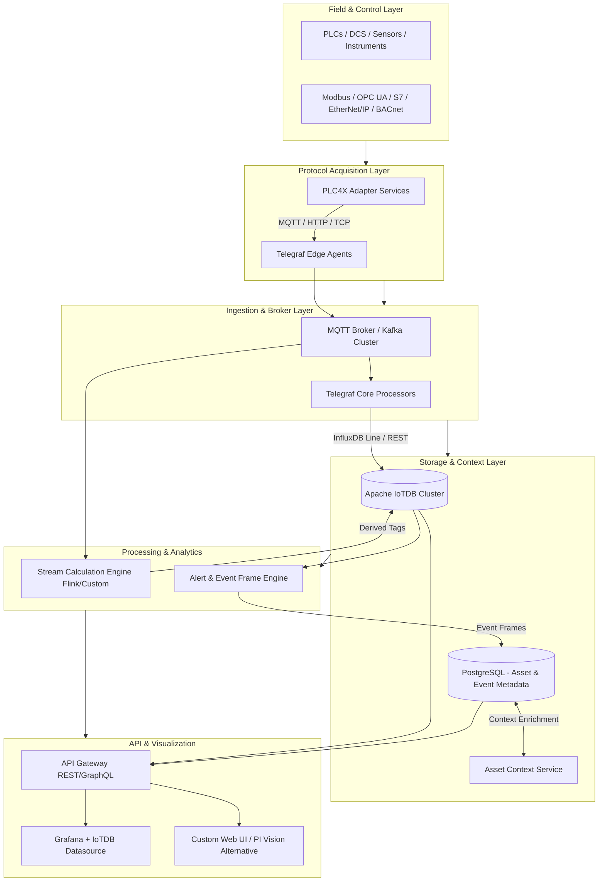
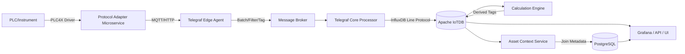

## Prompt 

I would like to build a system that mimics Aveva Pi System using Apache IoTDB as time series database and use telagraf as ingestion too and using PLC4X to communicate with various instruments. Please come up with design spec and architecture. Please include diagrams as well.

## Qwen3.6-Max-Preview Answer

# Design Specification: Open-Source PI System Alternative
**Stack:** Apache PLC4X + Telegraf + Apache IoTDB + Supporting Services  
**Goal:** Replicate core AVEVA PI System capabilities (real-time acquisition, high-performance time-series storage, asset contextualization, calculations, visualization, and enterprise access) using open-source components.

---
## 📐 1. High-Level Architecture



---
## 🔄 2. Data Flow Diagram



---
## 🧩 3. Component Specification

| Component | Role | PI Equivalent | Implementation Notes |
|-----------|------|---------------|----------------------|
| **Apache PLC4X** | Industrial protocol communication | PI Interfaces / Connectors | Wrap in lightweight Java/Quarkus/Spring Boot services. Poll/subscribe → publish to MQTT/HTTP. Supports Modbus, S7, OPC UA, EtherNet/IP, BACnet, etc. |
| **Telegraf** | Ingestion, buffering, tagging, routing | PI Buffer Subsystem / PI Connectors | Edge agents collect from PLC4X adapters. Core processors apply transformations, batching, retry. Outputs to IoTDB via InfluxDB line protocol (`outputs.influxdb_v2` pointing to IoTDB REST). |
| **Message Broker** | Decoupling, backpressure, replay | PI Buffer / PI Message Queue | EMQX (MQTT) or Apache Kafka. Enables multi-consumer, replay, edge-cloud sync, and HA. |
| **Apache IoTDB** | Time-series storage & compression | PI Data Archive | Cluster mode (3+ ConfigNodes, 3+ DataNodes). Native compression (LZ4/ZSTD/SDT). TTL-based retention. Supports InfluxDB line protocol & REST. Edge-cloud sync via `sync` module. |
| **PostgreSQL + Asset Context Service** | Asset hierarchy, metadata, event frames | PI Asset Framework (AF) | IoTDB templates for tag schema. PostgreSQL stores asset trees, relationships, units, descriptions, event frames. Custom service joins TS data with context on query. |
| **Stream Calculation Engine** | Real-time math, aggregations, stateful calcs | PI Performance Equations / ACE | Apache Flink (recommended) or custom Python/Java service. Consumes from broker, computes derived tags, writes back to IoTDB. Supports time-windowed, stateful, and conditional logic. |
| **Alert & Event Frame Engine** | Thresholds, state tracking, event boundaries | PI Event Frames / PI Notifications | Rule engine (Drools, Node-RED, or custom) monitoring IoTDB streams or broker. Stores event frames in PostgreSQL. Triggers webhooks, emails, or Grafana alerts. |
| **API Gateway & Services** | Secure data access, federation | PI Web API / PI AF SDK | Kong/Traefik + custom REST/GraphQL services. JWT/OAuth2 auth. Caching, rate limiting, audit logging. |
| **Visualization** | Dashboards, trends, alarm views | PI Vision / ProcessBook | Grafana (official IoTDB plugin) + custom React/Angular UI for AF-like navigation, event frames, and PI Vision-style displays. |

---
## 📥 4. Ingestion Pipeline Design

1. **Protocol Acquisition:** PLC4X adapters run as stateless microservices. Config-driven polling/subscription. Output: JSON/CSV over MQTT or HTTP.
2. **Edge Telegraf:** Consumes adapter output. Applies initial tags (`site`, `area`, `device`, `protocol`). Batches (1k-5k points), retries, buffers to disk on network loss.
3. **Broker:** Decouples edge from core. Enables replay, multi-tenant routing, and backpressure handling.
4. **Core Telegraf:** Enriches tags, filters noise, applies deadband/thresholds, converts units. Writes to IoTDB via InfluxDB line protocol over HTTP.
5. **IoTDB Ingestion:** High-throughput batch writes. Automatic schema creation via templates. Compression applied on flush.

**Telegraf → IoTDB Configuration Snippet:**
```toml
[[outputs.influxdb_v2]]
  urls = ["http://iotdb-rest:18080"]
  token = "iotdb-rest-token"
  organization = "default"
  bucket = "industrial"
  content_encoding = "gzip"
```
*(IoTDB's REST API accepts InfluxDB line protocol natively.)*

---
## 🗄️ 5. Storage, Compression & Retention

| Feature | Implementation |
|---------|----------------|
| **Compression** | IoTDB native: LZ4/ZSTD (lossless), SDT/PLAD (lossy). Configurable per measurement. |
| **Tiered Storage** | Hot (NVMe, 30d) → Warm (SSD, 1y) → Cold (S3/HDFS via IoTDB sync or external archival). |
| **Retention** | TTL per database/storage group. Automated compaction & deletion. |
| **High Write Throughput** | Batch ingestion, async WAL, out-of-order tolerance, multi-data-node sharding. |
| **Query Optimization** | Time-range partitioning, index on time + device, downsampled aggregates via continuous queries or Flink. |

---
## 🌳 6. Asset Context & Metadata (PI AF Alternative)

AVEVA PI's strength is the Asset Framework. Replicate with:

- **IoTDB Templates:** Define measurement schemas, data types, units, encoding.
- **PostgreSQL Schema:**
  - `assets` (id, name, parent_id, type, site, area)
  - `asset_tags` (asset_id, iotdb_path, description, unit, min, max)
  - `event_frames` (id, asset_id, start_time, end_time, state, metadata JSON)
- **Asset Context Service:** REST/GraphQL API that:
  - Resolves asset paths to IoTDB timeseries
  - Joins real-time/historical data with metadata
  - Supports template inheritance, roll-up queries, and event frame retrieval
- **Migration/Import:** CSV/JSON importers, OPC UA node mapping scripts, or custom AF XML parser.

---
## 🧮 7. Calculations, Alerts & Event Frames

| PI Feature | Open-Source Replacement | Notes |
|------------|------------------------|-------|
| Performance Equations | Flink SQL / Telegraf processors | Stateful, time-aware math. Flink handles windows, joins, and complex logic. |
| ACE (Advanced Calc Engine) | Custom microservice / Python Pandas on schedule | Batch or streaming. Writes derived tags back to IoTDB. |
| Event Frames | Rule Engine + PostgreSQL | Detect state changes, threshold breaches, or custom conditions. Store boundaries & context. |
| Notifications | Grafana Alerting / Alertmanager / Custom webhook service | Email, SMS, Teams, Slack. Escalation policies via external tool. |

**Example Flink SQL for Derived Tag:**
```sql
INSERT INTO iotdb_sink
SELECT 
  device_id,
  (temp * 1.8) + 32 AS temp_f,
  TUMBLE_START(proc_time, INTERVAL '1' MINUTE) AS ts
FROM iotdb_source
GROUP BY device_id, TUMBLE(proc_time, INTERVAL '1' MINUTE);
```

---
## 🌐 8. API, Visualization & Integration

- **REST/GraphQL API:** Unified endpoint for TS queries, asset navigation, event frames, and calculations. JWT auth, RBAC, audit logs.
- **Grafana:** Official IoTDB datasource plugin. Dashboards for trends, alarms, KPIs. Alerting via Grafana or external.
- **Custom UI:** React/Angular app mimicking PI Vision:
  - Asset tree navigation
  - Trend overlays, XY plots, gauges
  - Event frame timeline & annotation
  - Role-based display templates
- **Third-Party Integration:** ODBC/JDBC via IoTDB, MQTT publish for downstream systems, Kafka connectors for ERP/MES.

---
## 🛡️ 9. High Availability, Scalability & Edge Deployment

| Layer | HA/Scale Strategy |
|-------|-------------------|
| **PLC4X Adapters** | Stateless, containerized, deploy per zone. Health checks + auto-restart. |
| **Telegraf** | Multiple instances per site. Disk buffering (`metric_buffer_limit`). No single point of failure. |
| **Broker** | EMQX/Kafka cluster (3+ nodes). Replication factor ≥2. |
| **IoTDB** | Cluster mode: 3 ConfigNodes (Raft), 3+ DataNodes. Cross-AZ deployment. Automatic failover. |
| **PostgreSQL** | Patroni + PgBouncer. Streaming replication. Automated backups. |
| **Edge Deployment** | IoTDB edge node + Telegraf + broker. Sync to cloud via IoTDB `sync` module or Kafka MirrorMaker. Store-and-forward on disconnect. |
| **Scaling** | Horizontal: add DataNodes, Telegraf instances, Flink TaskManagers. Vertical: tune IoTDB compaction, WAL, batch sizes. |

---
## 🔐 10. Security & Compliance

- **Network:** VLAN segmentation, zero-trust architecture, firewall rules per zone (ISA-95/IEC 62443).
- **Transport:** TLS 1.2+ everywhere. mTLS for PLC4X → Broker → Telegraf → IoTDB.
- **Authentication:** JWT/OAuth2 for APIs. IoTDB RBAC. PostgreSQL roles. Broker ACLs.
- **Data Protection:** Encryption at rest (IoTDB supports disk encryption via OS/LUKS). Audit logging for config changes & data access.
- **Compliance:** Align with IEC 62443, NIST SP 800-82, GDPR/CCPA for metadata. Regular pen testing & CVE scanning.

---
## ⚖️ 11. Limitations vs AVEVA PI & Mitigation

| PI Feature | Gap | Mitigation |
|------------|-----|------------|
| Native Asset Framework | Must build custom service + PostgreSQL | Use IoTDB templates + graph DB (Neo4j) if complex relationships needed. Provide AF import tools. |
| PI Vision / ProcessBook | No native equivalent | Grafana + custom React UI. Invest in display templating & role-based views. |
| Certified Connectors | PLC4X covers many, but not all | Add OPC UA server, MQTT bridges, or commercial protocol gateways where needed. |
| Enterprise Support | Community-driven | Partner with IoTDB/Telegraf vendors, build internal SRE team, or use managed services. |
| Advanced Analytics (PI AF SDK, PI OLEDB) | Different APIs | Provide REST/GraphQL, JDBC, Python/Java SDKs. Document migration paths. |

---
## 🗺️ 12. Implementation Roadmap

| Phase | Deliverables | Duration |
|-------|--------------|----------|
| **1. Foundation** | PLC4X adapters, Telegraf edge/core, IoTDB single-node, Grafana dashboards, basic REST API | 4-6 weeks |
| **2. Context & Storage** | IoTDB cluster, PostgreSQL metadata, Asset Context Service, TTL/compression tuning | 3-4 weeks |
| **3. Processing & Alerts** | Flink calculation engine, rule-based alerts, event frame storage, store-and-forward | 4-5 weeks |
| **4. Enterprise Ready** | API gateway, RBAC, audit logging, HA deployment, edge-cloud sync, custom UI v1 | 5-6 weeks |
| **5. Optimization & Scale** | Performance tuning, downsampled aggregates, backup/DR, monitoring (Prometheus), documentation | Ongoing |

---
## ✅ 13. Next Steps & Recommendations

1. **Proof of Concept:** Deploy PLC4X → Telegraf → IoTDB → Grafana with 3-5 real devices. Validate throughput, latency, and compression.
2. **Schema & Template Design:** Define IoTDB storage groups, templates, and PostgreSQL asset model early. Align with ISA-95 hierarchy.
3. **Calculation Strategy:** Start with Telegraf processors for simple math. Migrate complex/stateful calcs to Flink.
4. **Security Baseline:** Implement mTLS, RBAC, and network segmentation before production rollout.
5. **Monitoring:** Deploy Prometheus + Grafana for infrastructure, Telegraf, IoTDB, and broker metrics. Set SLOs for ingestion lag & query latency.
6. **Migration Path:** Build AF XML/CSV importers, tag mapping tools, and PI Web API compatibility layer if replacing existing PI systems.

---
## 📎 Appendix: Key Versions & Compatibility

| Component | Recommended Version | Notes |
|-----------|---------------------|-------|
| Apache IoTDB | 1.3.x+ | Cluster mode, InfluxDB line protocol, sync module |
| Telegraf | 1.28+ | `inputs.mqtt`, `processors.converter`, `outputs.influxdb_v2` |
| Apache PLC4X | 0.11+ | Java library. Wrap in Quarkus/Spring Boot microservice |
| EMQX / Kafka | 5.0+ / 3.6+ | MQTT or Kafka based on scale & replay needs |
| Apache Flink | 1.18+ | Stream processing, IoTDB connector available |
| Grafana | 10.2+ | Official IoTDB datasource plugin |
| PostgreSQL | 15+ | TimescaleDB extension optional for hybrid workloads |

---
This architecture delivers **~80% of core PI System functionality** using battle-tested open-source components. The remaining gap lies in enterprise polish, certified connectors, and native AF/Vision equivalents, which can be closed with targeted custom development or commercial partnerships.
